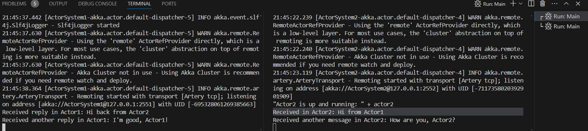

# Akka İki Aktör Uygulaması

Bu proje, Akka framework'ü kullanarak iki aktör arasında basit bir mesajlaşma uygulaması oluşturur. İki ayrı Java uygulaması kullanarak, bir aktör diğerine "Hi from Actor1" mesajı gönderir ve ikinci aktör bu mesaja "Hi from Actor2" ile cevap verir.

## Proje Yapısı

Bu proje iki ayrı uygulama içerir:
1. **akka_homework**: İlk aktörü başlatır ve diğer aktöre mesaj gönderir.
2. **akka_2**: İkinci aktörü başlatır ve gelen mesajlara yanıt verir.

## Kurulum

1. **Gereksinimler**
   - Java 17 veya üzeri
   - Maven 3.5 veya üzeri

## Konfigürasyon

### akka_homework `application.conf`

```hocon
akka {
  log-dead-letters = off
  log-dead-letters-during-shutdown = off
  actor {
    provider = "akka.remote.RemoteActorRefProvider"
  }
  remote {
    artery {
      transport = tcp
      canonical.hostname = "127.0.0.1"
      canonical.port = 2551
    }
  }
}
```

### akka_2 `application.conf`

```hocon
akka {
  log-dead-letters = off
  log-dead-letters-during-shutdown = off
  actor {
    provider = "akka.remote.RemoteActorRefProvider"
  }
  remote {
    artery {
      transport = tcp
      canonical.hostname = "127.0.0.1"
      canonical.port = 2552
    }
  }
}
```

## Kodlar

### Actor1

```java
public class Actor1 extends AbstractActor {
    private ActorSelection actor2Selection;

    public static Props props() {
        return Props.create(Actor1.class, () -> new Actor1());
    }

    @Override
    public Receive createReceive() {
        return receiveBuilder()
        		.match(StartMessage.class, msg -> {
                    this.actor2Selection = msg.actorSelection;
                    actor2Selection.tell("Hi from Actor1", getSelf());
                })
                .matchEquals("Hi back from Actor2", msg -> {
                    System.out.println("Received reply in Actor1: " + msg);
                    actor2Selection.tell("How are you, Actor2?", getSelf());
                })
                .matchEquals("I'm good, Actor1!", msg -> {
                    System.out.println("Received another reply in Actor1: " + msg);
                })
                .build();
    }
}

```

### Actor2

```java
public class Actor2 extends AbstractActor {
    public static Props props() {
        return Props.create(Actor2.class, Actor2::new);
    }

    @Override
    public Receive createReceive() {
        return receiveBuilder()
                .matchEquals("Hi from Actor1", msg -> {
                    System.out.println("Received in Actor2: " + msg);
                    getSender().tell("Hi back from Actor2", getSelf());
                })
                .matchEquals("How are you, Actor2?", msg -> {
                    System.out.println("Received another message in Actor2: " + msg);
                    getSender().tell("I'm good, Actor1!", getSelf());
                })
                .build();
    }
}
```

### akka_homework

```java
public class Main {
    public static void main(String[] args) {
        ActorSystem system = ActorSystem.create("ActorSystem1", ConfigFactory.load("app.conf"));
        ActorSelection actor2Selection = system.actorSelection("akka://ActorSystem2@127.0.0.1:2552/user/actor2");
        ActorRef actor1 = system.actorOf(Actor1.props(), "actor1");
        actor1.tell(new StartMessage(actor2Selection), ActorRef.noSender());
    }
}
class StartMessage {
    public final ActorSelection actorSelection;

    public StartMessage(ActorSelection actorSelection) {
        this.actorSelection = actorSelection;
    }
}

```

### akka_2

```java
public class Main {
    public static void main(String[] args) {
        ActorSystem system = ActorSystem.create("ActorSystem2", ConfigFactory.load("application.conf"));
        ActorRef actor2 = system.actorOf(Actor2.props(), "actor2");
        System.out.println("\"Actor2 is up and running: \" + actor2");
    }
}
```

## Çalıştırma

1. **akka_2'yi Başlatın:**
   - akka_2 sınıfını çalıştırın. Bu, `actor2` aktörünü başlatır ve dinlemeye başlar.

2. **akka_homework'ü Başlatın:**
   - akka_homework sınıfını çalıştırın. Bu, `actor1` aktörünü başlatır ve `actor2`'ye mesaj gönderir.



## Hata Ayıklama

- **`Unsupported class file major version 65`**: Java sürümünüz ile Maven sürümünüzün uyumlu olduğundan emin olun.
- **`Address already in use: bind`**: Farklı port numaraları kullandığınızdan emin olun.
