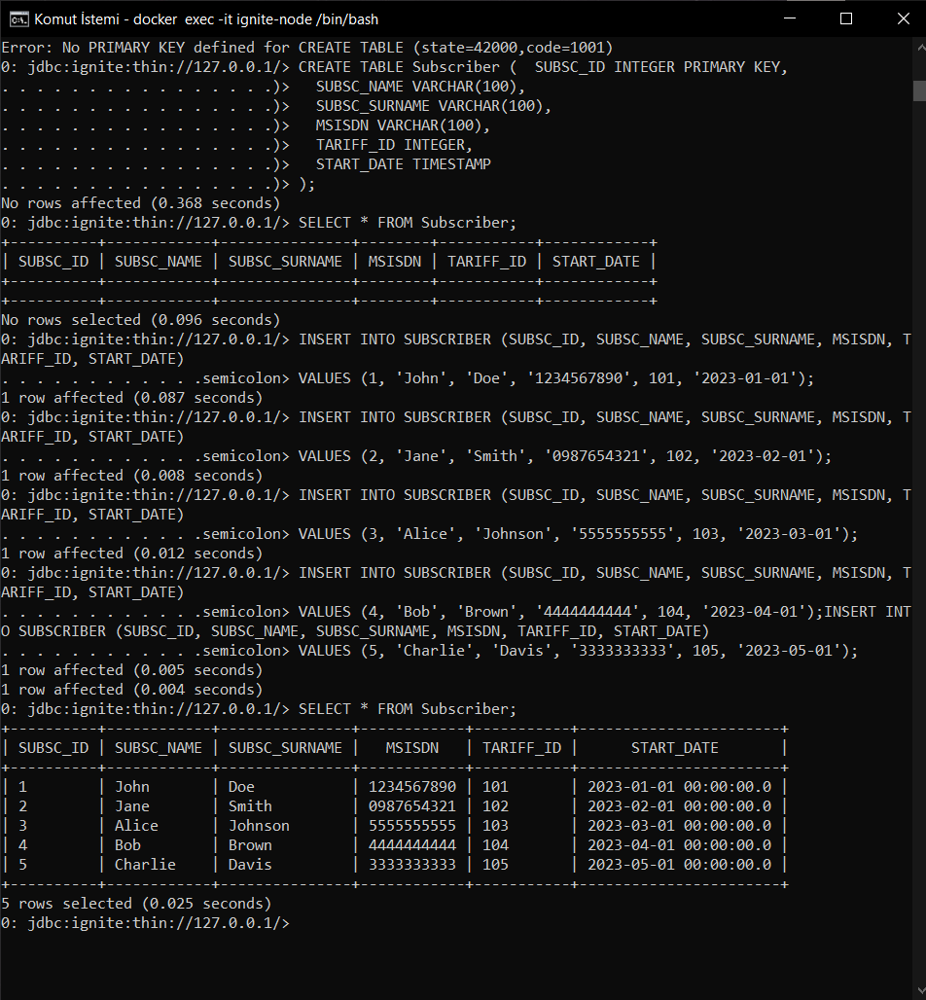
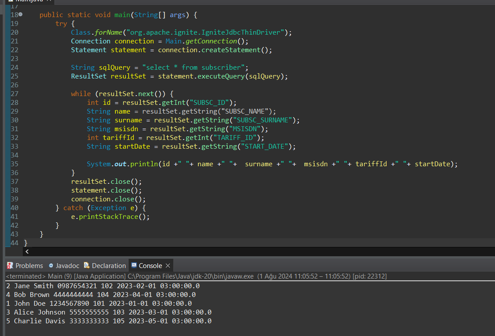

# Apache Ignite Alıştırma Projesi

Bu proje, Apache Ignite kullanarak bir tablo oluşturmayı, veri eklemeyi ve java ile veri çekmeyi göstermektedir.

## Gereksinimler

- Apache Ignite kurulu ve çalışır durumda.
- Java Development Kit (JDK) kurulu.

## Kurulum

1. **`SUBSCRIBER` Tablosunu Oluşturun**

   Aşağıdaki SQL komutlarını çalıştırarak `SUBSCRIBER` tablosunu oluşturun ve bazı örnek veriler ekleyin.

   

## Çıktı

- Program, SUBSCRIBER tablosunda depolanan tüm abonelerin detaylarını yazdıracaktır.

