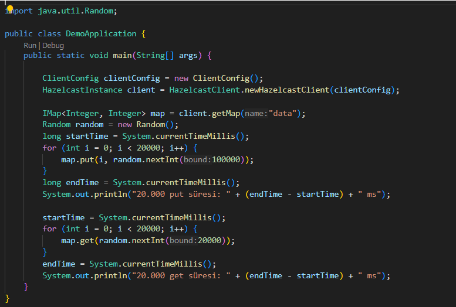
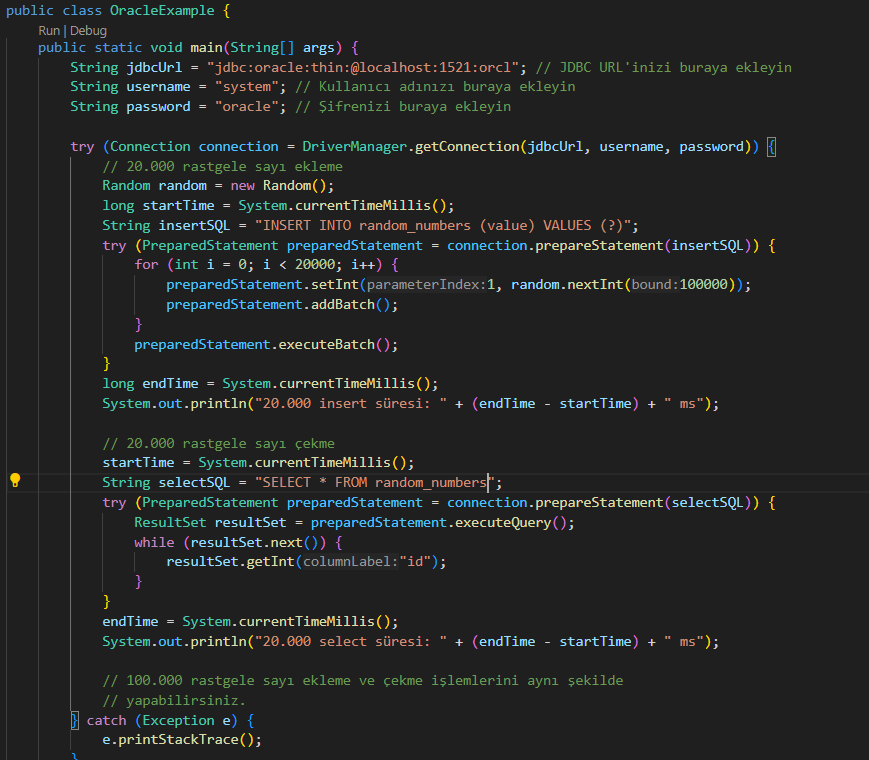
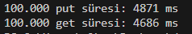
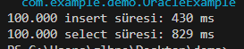

# HAZELCAST-ORACLE SQL KARŞILAŞTIRMASI

Bu projede, Hazelcast IMDG ve Oracle SQL kullanarak 20.000 rastgele sayının eklenmesi (put/insert) ve alınması (get/select) işlemlerinin performansını karşılaştıracağız.

## Gereksinimler

- Hazelcast IMDG
- Oracle SQL
- Java Development Kit (JDK)
- Maven (veya başka bir build aracı)

## Kurulum

### Hazelcast Kurulumu

1. Hazelcast IMDG'yi indirin ve yükleyin.
2. Hazelcast bağımlılığını Maven `pom.xml` dosyanıza ekleyin:
    ```xml
    <dependency>
        <groupId>com.hazelcast</groupId>
        <artifactId>hazelcast</artifactId>
        <version>4.2.1</version>
    </dependency>
    ```

### Oracle Kurulumu

1. Oracle SQL veritabanını kurun ve çalıştırın.
2. Gerekli Oracle JDBC sürücüsünü indirin ve projenize ekleyin.

## Uygulama Kodu

### Hazelcast Kodları

20000 tane rastgele sayı oluşturan ve bu sayılar için `put` ve `get` işlemlerini yapan kodlar:


### Oracle Kodları

Oracle SQL kullanarak 20000 tane rastgele sayı ekleme ve okuma işlemleri:


## Sonuçlar

### Hazelcast için 20.000 Sayı Yazdırma ve Okuma Süreleri


### Oracle SQL için 20.000 Sayı Yazdırma ve Okuma Süreleri


### Hazelcast için 100.000 Sayı Yazdırma ve Okuma Süreleri


### Oracle SQL için 100.000 Sayı Yazdırma ve Okuma Süreleri


## Karşılaştırma Tablosu

| İşlem                  | Hazelcast Süresi (ms)  | Oracle SQL Süresi (ms) |
|------------------------|------------------------|------------------------|
| 20.000 put/insert      | 1789                   | 196                    |
| 20.000 get/select      | 1170                   | 394                    |
| 100.000 put/insert     | 4871                   | 430                    |
| 100.000 get/select     | 4686                   | 829                    |