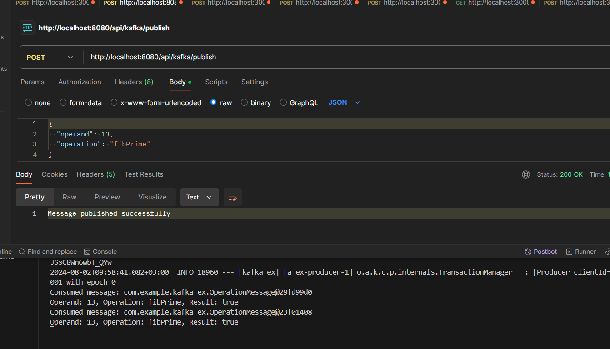

# Kafka ve Kafdrop ile Spring Boot Uygulaması

Bu proje, Spring Boot uygulaması ile Kafka'ya mesaj gönderme ve alma işlemleri ile ilgili örnek bir kullanımını içerir.

## Kurulum Adımları

### 1. Docker ve Kafka Kurulumu

Docker Compose ile Kafka ve Zookeeper kurulumunu:

#### `docker-compose.yml` Dosyası

```yaml
version: '3.7'
services:
  zookeeper:
    image: confluentinc/cp-zookeeper:7.3.2
    environment:
      ZOOKEEPER_CLIENT_PORT: 2181
      ZOOKEEPER_TICK_TIME: 2000
    ports:
      - "2181:2181"

  kafka:
    image: confluentinc/cp-kafka:7.3.2
    ports:
      - "9092:9092"
    environment:
      KAFKA_BROKER_ID: 1
      KAFKA_ZOOKEEPER_CONNECT: zookeeper:2181
      KAFKA_ADVERTISED_LISTENERS: PLAINTEXT://localhost:9092
      KAFKA_OFFSETS_TOPIC_REPLICATION_FACTOR: 1
    depends_on:
      - zookeeper

  kafdrop:
    image: obsidiandynamics/kafdrop:latest
    container_name: kafdrop
    restart: "no"
    ports:
      - "9000:9000"
    environment:
      KAFKA_BROKERCONNECT: kafka:9092
    depends_on:
      - kafka
   
```

### Docker Compose ile servisleri başlatın:

```sh
docker-compose up -d
```

### 5. Output
POSTMAN kullanarak istek atıldıktan sonra çıktı:


