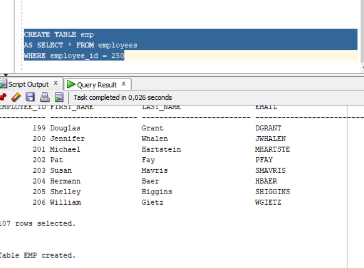
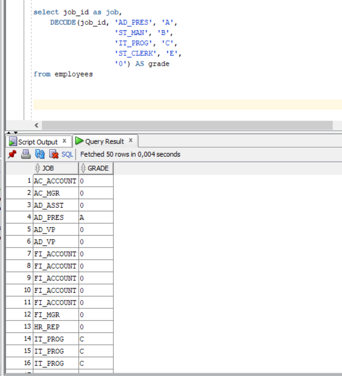

# SQL Sorguları
1. Write an SQL query that selects employee’s id, employee’s first name and employee’s department name for all employees.

2. Create a report that displays the employee’s id and their manager’s id.

3. For example; first three character of PHONE_NUMBER column gives us a operator of employee. Create a report that displays the operators and their total subscriber. But we want two different displays with diffrent queries.

4. Create a table (table name like HR.EMP) from HR.EMPLOYEES table. Insert a new row to HR.EMP table and update this employee’s phone number and salary. Delete your new row and display the HR.EMP table. Finally drop your table HR.EMP.

 

5.  Select employees’ first name and last name as masked with “*” character.

6. Write an SQL query that selects employee’s id, employee’s first name, employee’s last name and employee’s number of months from hire_date to today for all employees. 

7. Write a query that displays the grade of all employees based on the value of the column JOB_ID, using the following data.

8. Write a query for previous question with using CASE WHEN.

9. Write a query that displays the employee number and last name of all employees who work in a department with any employee whose last name contains a “i”.

10. 
- Create a table for MY_EMP_TABLE with following columns
- Insert following rows, 
- Update salary with 1.10 times of salary value
- Delete rows which first_name is David 
- Truncate table. 

