# SQL Sorguları
1. 
- Write  followig SQL queries:
- Add a colum to employees table named MAX_SALARY.
- Update MAX_SALARY with maximum salary amount with subquery.
- Delete employee who have minimum salary using subquery.

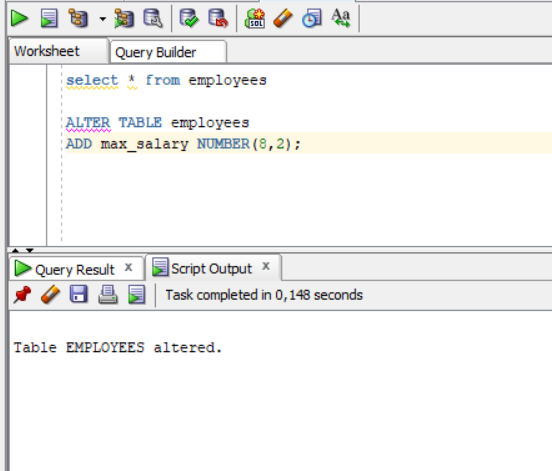
 
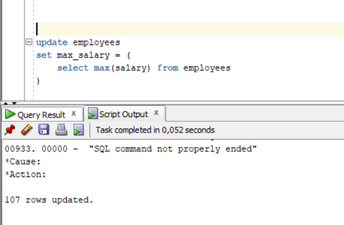

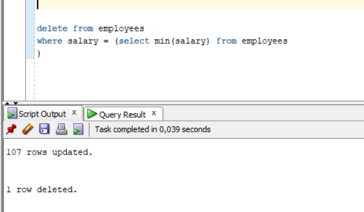

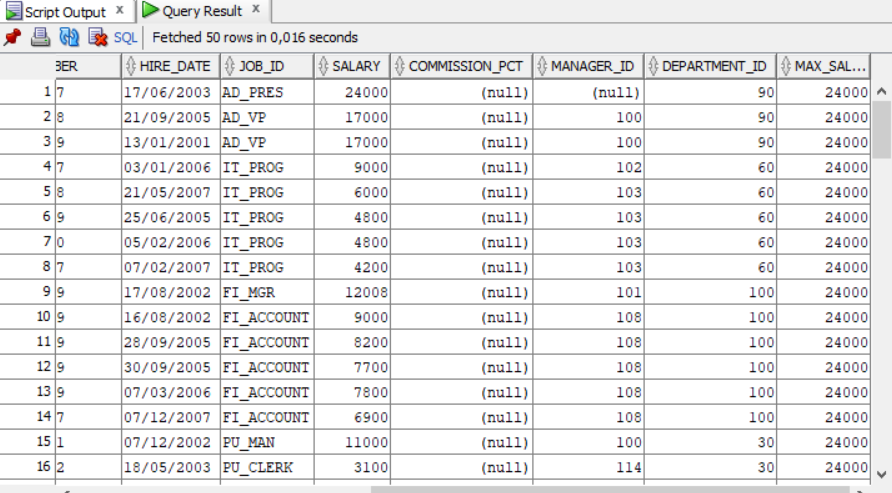

2. 
- Define index (named DPR_NAME_IDX) on DEPARTMENT_NAME column of DEPARTMENTS table.
- Define constraint (named CNSTR_SALARY) on employee salary. (Salary must be between 1000$ and 100.000$)
- Drop defined index.
- Enable, disable, drop defined constraint.

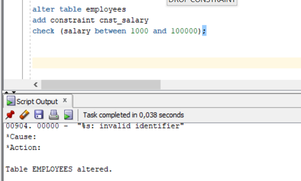

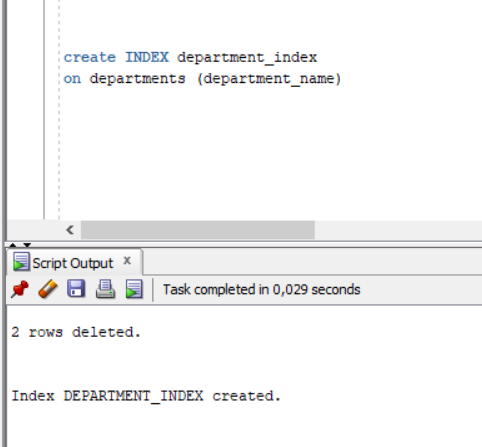

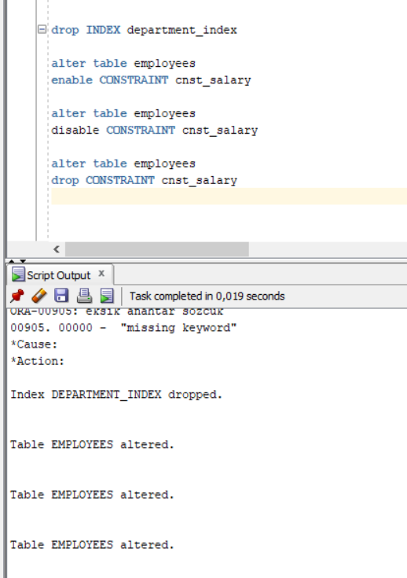

3. Create a table from EMPLOYEES with distinct department_id column. Add department_name to that table. With DEPARTMENTS table, update department_name for included department_ids and insert department_id and department_name values for not included rows. Use MERGE keyword.

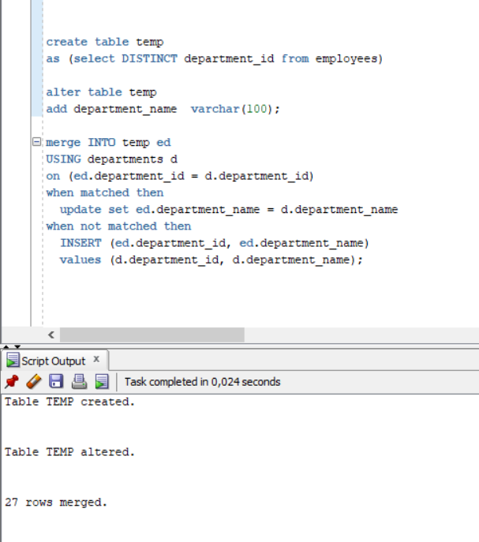

4. 
- Firstly select first_name, last_name, job_id, department_id from employees table whoes job_id starts with ‘S’.
- Additionally select job_title and min-max  salary amount.
- Add  department_name to that query.
- Lastly concat first_name and last_name with space as full_name alias and list with other selected columns.

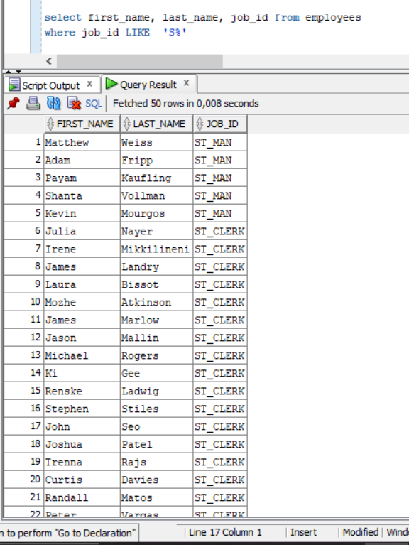

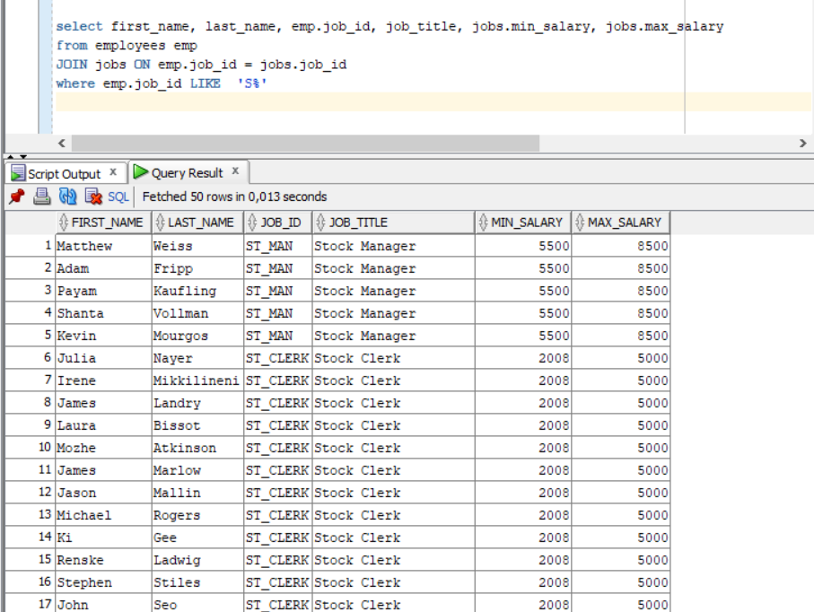

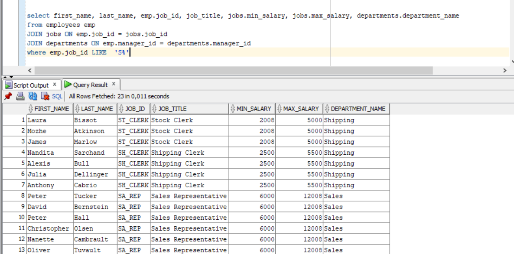

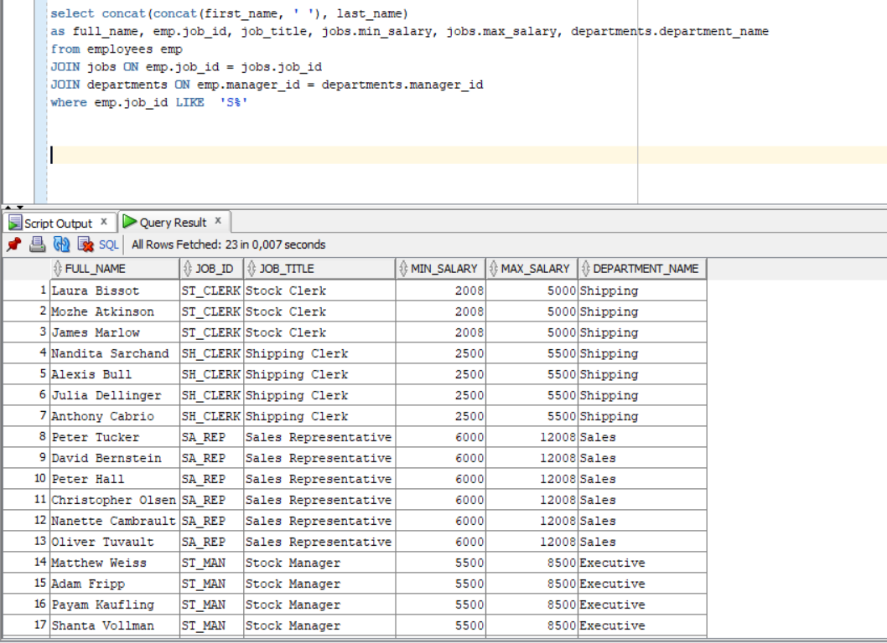

5.  Search for COMMIT and ROLLBACK keywords and explain them.

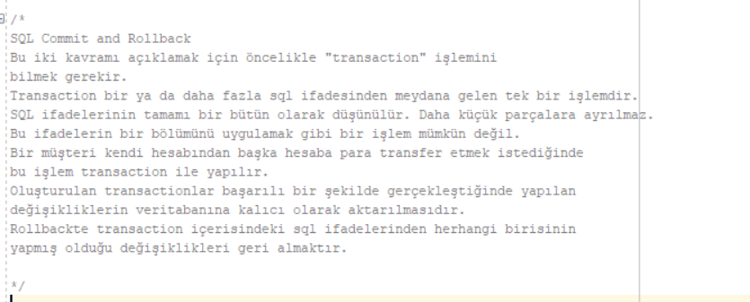