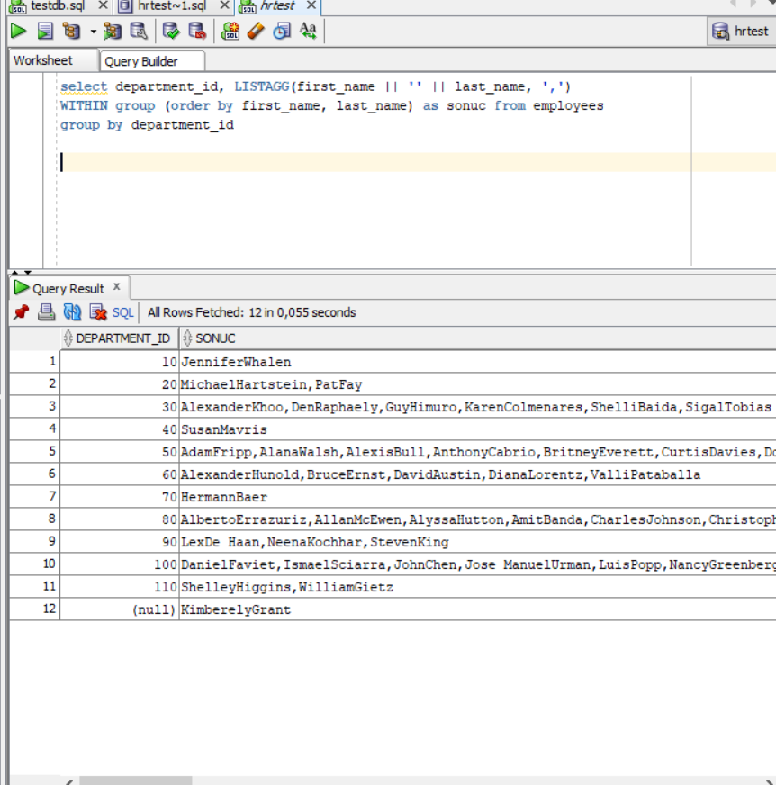
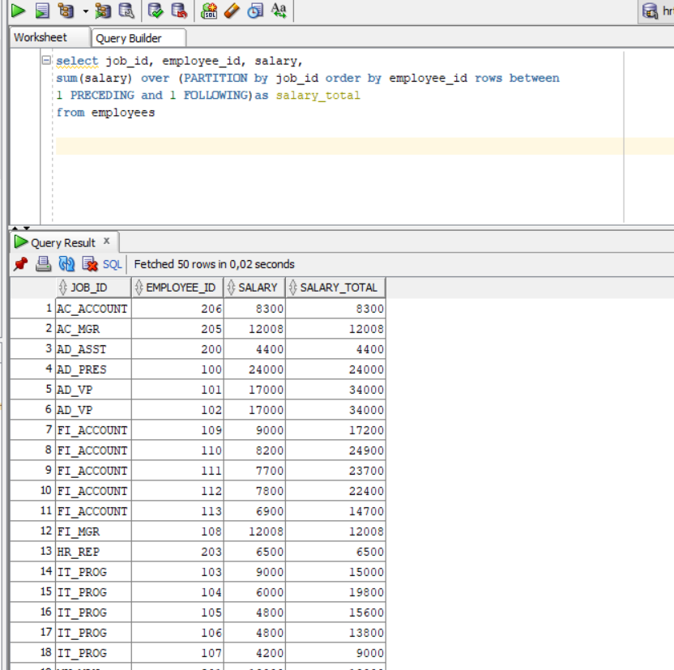
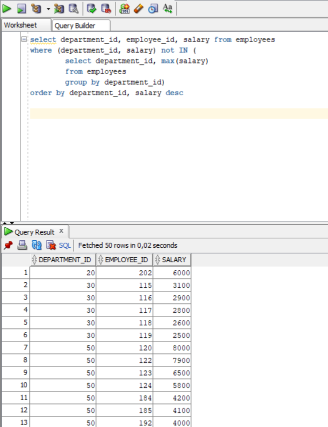
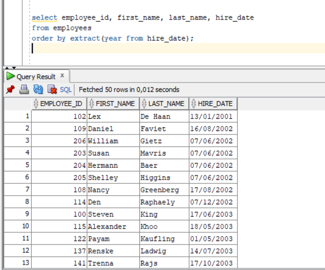
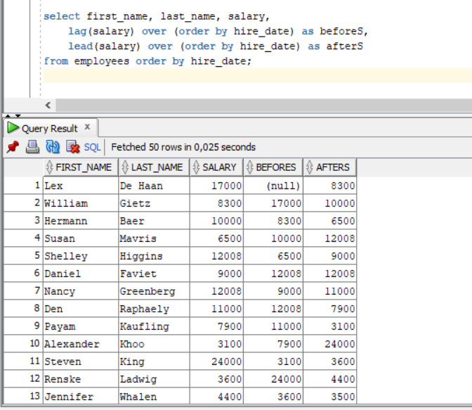

# SQL Sorguları
1. List employees’ first name and last name in same department in one row.

2. List employees’ first name and last name in same department in one row.

3. List employees’ salary orders in their department and exclude higest salaried employee.

4. List employees’ hire order according to hiredate year value.

5. List employees’ firstname, lastname, salary and salaries of employees’ hired before and after this employee according to hirededate. 

