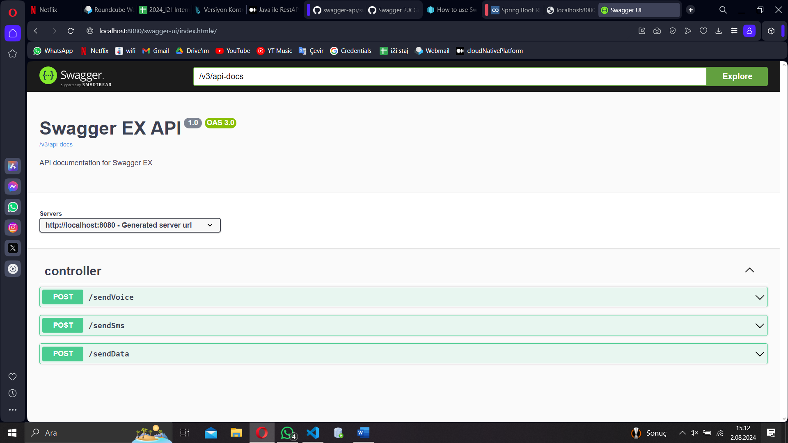
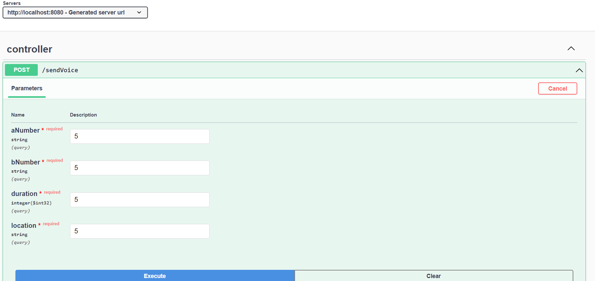
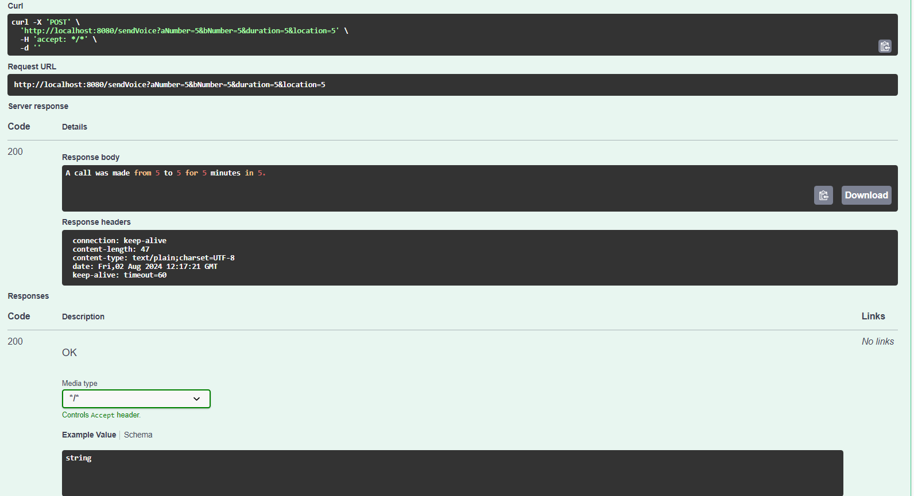

# Swagger Örnek Kullanımı

Bu proje, Spring Boot ve Springdoc OpenAPI kullanarak temel API dokümantasyonu oluşturmayı göstermektedir. Projede sesli arama, SMS ve veri gönderme gibi işlemler için örnek REST API bulunmaktadır.

## Proje Yapısı

- **sendVoice:** A numarasından B numarasına belirli bir süre ve lokasyonda yapılan aramayı simgeler.
- **sendSms:** A numarasından B numarasına belirli bir lokasyonda gönderilen SMS'i simgeler.
- **sendData:** A numarasından belirli bir MB miktarında, belirli bir Rating Group (RG) ile gönderilen veri kullanımını simgeler.


## API Kullanımı

### sendVoice

- **URL:** `/sendVoice`
- **Method:** `POST`
- **Parameters:**
  - `aNumber`: Arayan numara (String)
  - `bNumber`: Aranan numara (String)
  - `duration`: Arama süresi (int)
  - `location`: Arama yapılan lokasyon (String)
- **Örnek Cevap:**
  ```json
  {
    "message": "A call was made from 1234567890 to 0987654321 for 5 minutes in New York."
  }
  ```

### sendSms

- **URL:** `/sendSms`
- **Method:** `POST`
- **Parameters:**
  - `aNumber`: Gönderen numara (String)
  - `bNumber`: Alıcı numara (String)
  - `location`: SMS gönderilen lokasyon (String)
- **Örnek Cevap:**
  ```json
  {
    "message": "An SMS was sent from 1234567890 to 0987654321 in New York."
  }
  ```

### sendData

- **URL:** `/sendData`
- **Method:** `POST`
- **Parameters:**
  - `aNumber`: Veri gönderen numara (String)
  - `mb`: Gönderilen veri miktarı (int)
  - `rg`: Rating Group (int)
  - `location`: Veri gönderilen lokasyon (String)
- **Örnek Cevap:**
  ```json
  {
    "message": "Data usage of 100 MB from 1234567890 in Rating Group 1 at New York."
  }
  ```

## OUTPUT
- Uygulama çalıştığında görütülenen Swagger UI:



- Örnek bir post isteği:



- Post isteğinin çıktısı:

