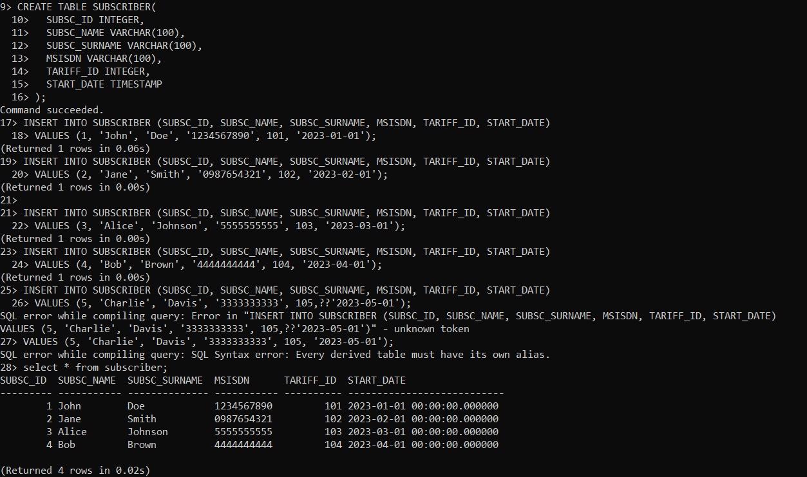
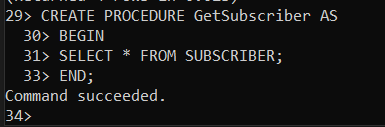
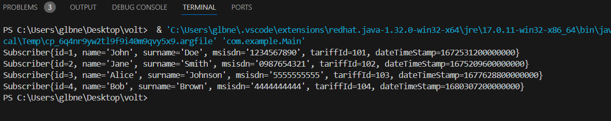

# VoltDB Alıştırma Projesi

Bu proje, VoltDB kullanarak bir tablo oluşturmayı, veri eklemeyi ve bir procedure kullanarak veriyi almayı göstermektedir. Proje, VoltDB sunucusuna bağlanmak ve verileri almak için Java kodunu içermektedir.

## Gereksinimler

- VoltDB kurulu ve çalışır durumda.
- Java Development Kit (JDK) kurulu.
- VoltDB istemci kütüphanesi (`voltdbclient`) projeye eklenmiş.

## Kurulum

1. **`SUBSCRIBER` Tablosunu Oluşturun**

   Aşağıdaki SQL komutlarını çalıştırarak `SUBSCRIBER` tablosunu oluşturun ve bazı örnek veriler ekleyin.

   

2. **Procedure Oluşturun**

    Aşağıdaki SQL komutunu çalıştırarak GetSubscriber procedure'ü oluşturun.

    

## Projeyi Çalıştırma

- VoltDB sunucusunun çalıştığından emin olun.
- Java projesini derleyin ve çalıştırın (örneğin, bir IDE veya komut satırı kullanarak).

## Çıktı

- Program, SUBSCRIBER tablosunda depolanan tüm abonelerin detaylarını yazdıracaktır.

## Notlar
- VoltDB istemci kütüphanesinin proje bağımlılıklarınıza doğru şekilde eklendiğinden emin olun.
- Main.java dosyasındaki bağlantı dizesini, VoltDB sunucunuzun adresi ve portuna göre düzenleyin.